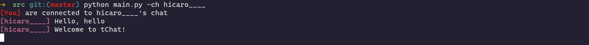

# tChat

<div align="center">
 
 <p> <i> :speech_balloon: A Twitch chat UI for your terminal. </i> </p>
</div>

## Installation

```
pip install tChat
```

## Usage

```
tChat -ch <channel name>
```

For example: `python3 src/main.py -ch shroud` where `shroud` is a Twitch streamer and we want to join his chat using tChat.

If it is your first time, you probably don't have a configuration file, therefore the program will ask you two things: your Twitch nickname and your OAuth token.

**IMPORTANT**: Use this website to get your oauth token: [Twitch Chat OAuth Password Generator](https://twitchapps.com/tmi/)

## Troubleshooting

1. Blank nicknames

   Be careful with the colors of your terminal. Sometimes it's gonna look like that the nickname is blank, but it is not, actually. You can try changing your terminal color background and see what fits better for you.

## License
[MIT](./LICENSE)
